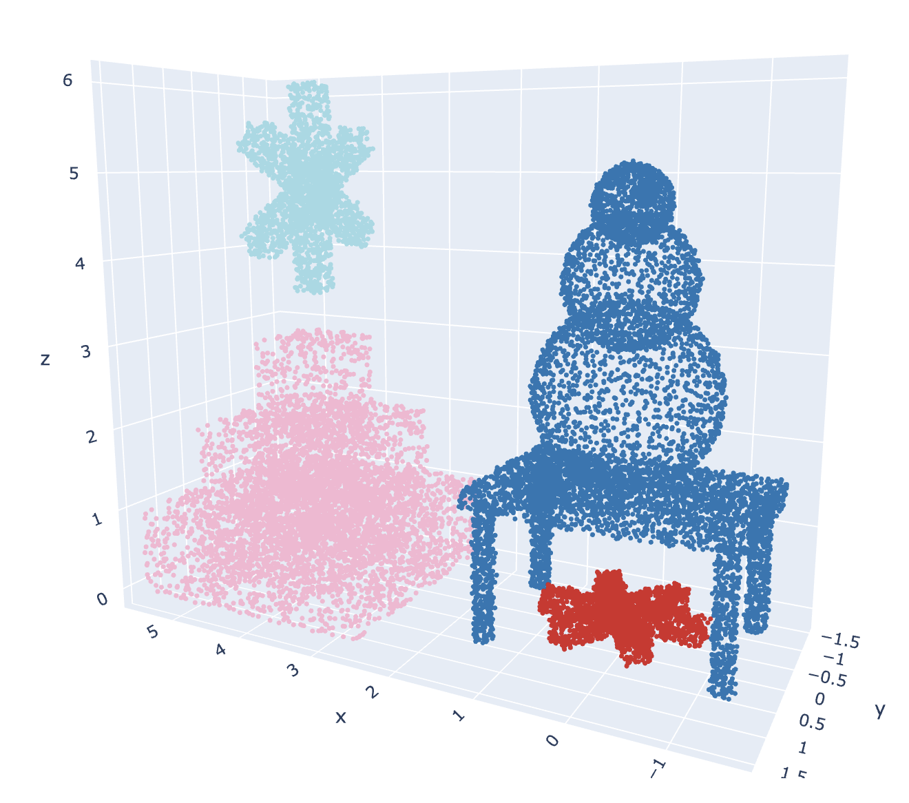
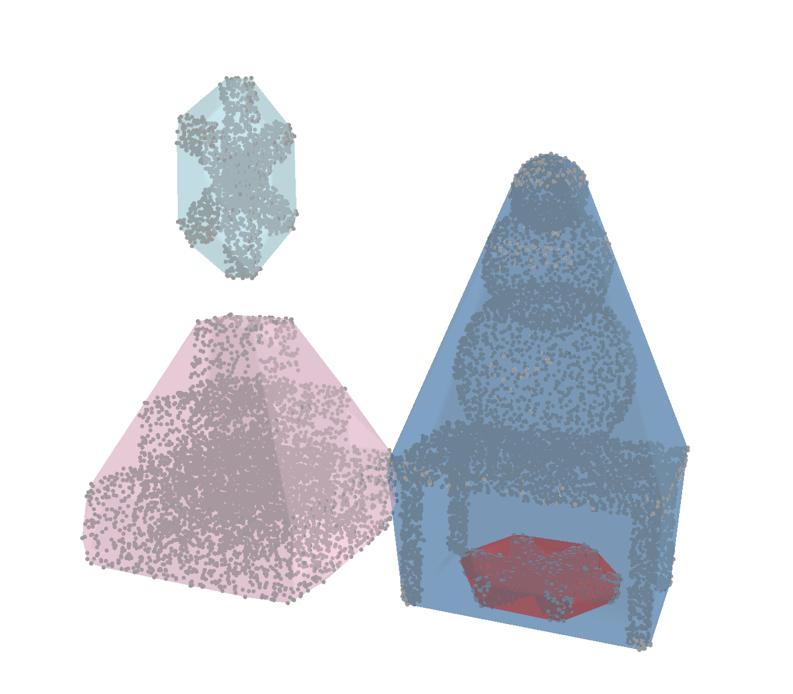

# Task_12 по курсу "Трехмерные модели"

**Выполнила:** Большова Елизавета Александровна

## Результаты работы
Реализован и исследован пайплайн сегментации трехмерных сцен и отдельных геометрических примитивов.
**Исходная сцена:** пирамида, стол, звезда из прямоугольников, снеговик и звезда из конусов.
**Реализованные методы:**
1. **DBSCAN:** Кластеризация по плотности. Разделение объектов на сцене (получилось 4 кластера).
2. **RANSAC:** Итеративный поиск опорных плоскостей.
3. **Planar Patches:** Детектирование ориентированных плоских участков (OBB) с анализом нормалей.
4. **Alpha Shapes:** Реконструкция поверхности (применена для сложных вогнутых объектов).

Все результаты визуализированы с использованием библиотеки Plotly (Solid Meshes & Dense Points) и сохранены в директории `results/`.

## Описание процесса и анализ результатов

1.  **Генерация данных:** К облакам точек фигур добавлен Гауссов шум ($\sigma=0.015$).
2.  **Кластеризация (DBSCAN):** На общей сцене алгоритм показал высокую эффективность (`eps=0.35`, `min_points=20`). Объекты, разнесенные в пространстве, были корректно разделены. Для визуализации объемов построены выпуклые оболочки (Convex Hulls).
    *   Объекты, изолированные в пространстве (Пирамида, 2 звезды), были корректно разделены в отдельные кластеры.
    *   Стол и Снеговик были выделены как единый кластер. Это ожидаемо для метода, основанного на плотности: так как снеговик стоит на поверхности стола, облака точек соприкасаются, образуя непрерывную связную область (расстояние между точками меньше `eps`).
4.  **Сегментация плоских объектов (Пирамида, Стол):**
    *   **RANSAC** идеально справился с выделением столешницы и крупных граней пирамиды.
    *   **Planar Patches** показал наилучший результат на пирамиде, восстановив иерархию ступеней.
5.  **Звезда, Снеговик:**
    *   Для **Звезды** метод Patches оказался неприменим из-за вогнутой топологии (прямоугольные патчи перекрывают пустоты). Был применен метод **Alpha Shapes**, давший корректную реконструкцию.
    *   Для **Снеговика** (сферы) методы поиска плоскостей ожидаемо не дали конструктивного результата. При строгой настройке параметров (`normal_variance < 5°`) алгоритм корректно вернул 0 найденных плоскостей.

### Сравнительная таблица параметров и методов

Ниже приведена таблица применимости алгоритмов к различным типам геометрии с указанием параметров.

| Объект | Лучший метод | Оценка RANSAC | Оценка Patches | Ключевые параметры |
| :--- | :--- | :--- | :--- | :--- |
| **Общая сцена** | **DBSCAN** | — | — | `eps=0.35`, `min_points=20`. Разделяет объекты, но стол объединил со снеговиком. |
| **Пирамида** | **Patches** | Хорошо (дробит грани) | **Отлично** | `min_edge=0.15`, `outlier=0.75`. Восстанавливает сложную ступенчатую структуру. |
| **Стол** | **Hybrid** | **Отлично** (для верха) | Хорошо (только верх) | `radius=0.05` (малый, для острых углов). Ножки (цилиндры) игнорируются патчами. |
| **Звезда** | **Alpha Shapes** | Хорошо (слои) | Плохо (вогнутость) | `thresh=0.08` для RANSAC (поглощение шума). Patches создают артефакты на вогнутых формах. |
| **Снеговик** | — | Артефакты (срезы) | **Корректный отказ** | `variance=5°`, `outlier=0.05`. Строгие настройки заставляют алгоритм игнорировать сферы. |

## Примеры визуализации

### 1. Исходная сцена (с шумом)

### 2. Кластеризация DBSCAN (Разделение объектов)

### 3. DBSCAN + Convex Hulls 

---
**Остальные результаты визуализации доступны в папке `Task_12/results`.**

## Технические особенности реализации

1.  **Архитектура ARM64 (Apple Silicon):** В связи с ограничениями графического стека Open3D на macOS, пайплайн визуализации полностью переписан на библиотеку **Plotly**.
2.  **Solid Visualization:** 
    *   Патчи (OBB) рендерятся как полупрозрачные `Mesh3d`.
    *   Точки RANSAC рендерятся с увеличенным размером (`size=4`) для имитации сплошной поверхности.
3.  **Оптимизация:** Все вычисления переведены на cpu.
