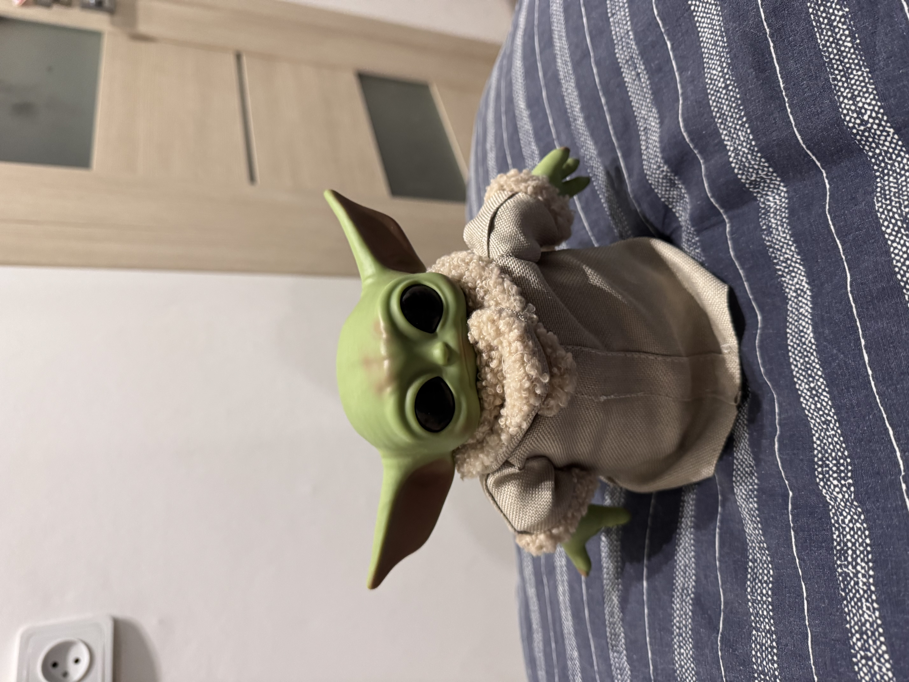
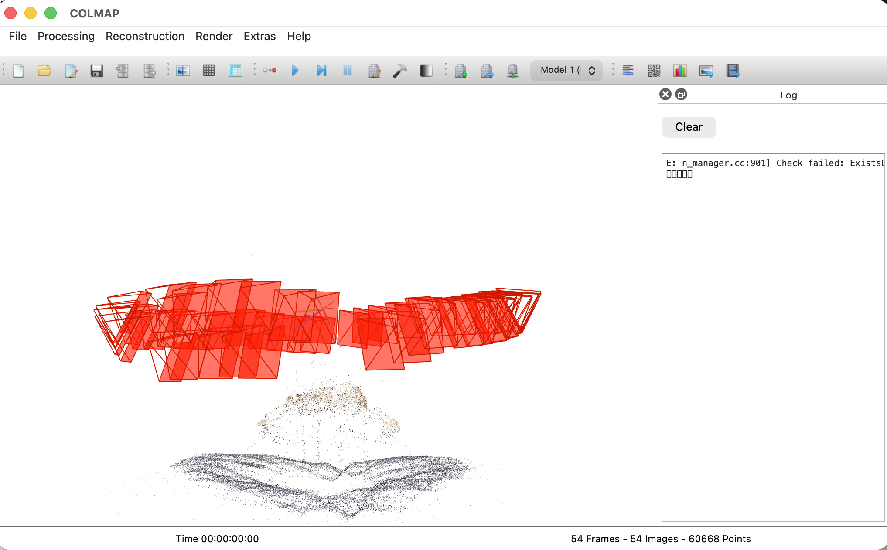
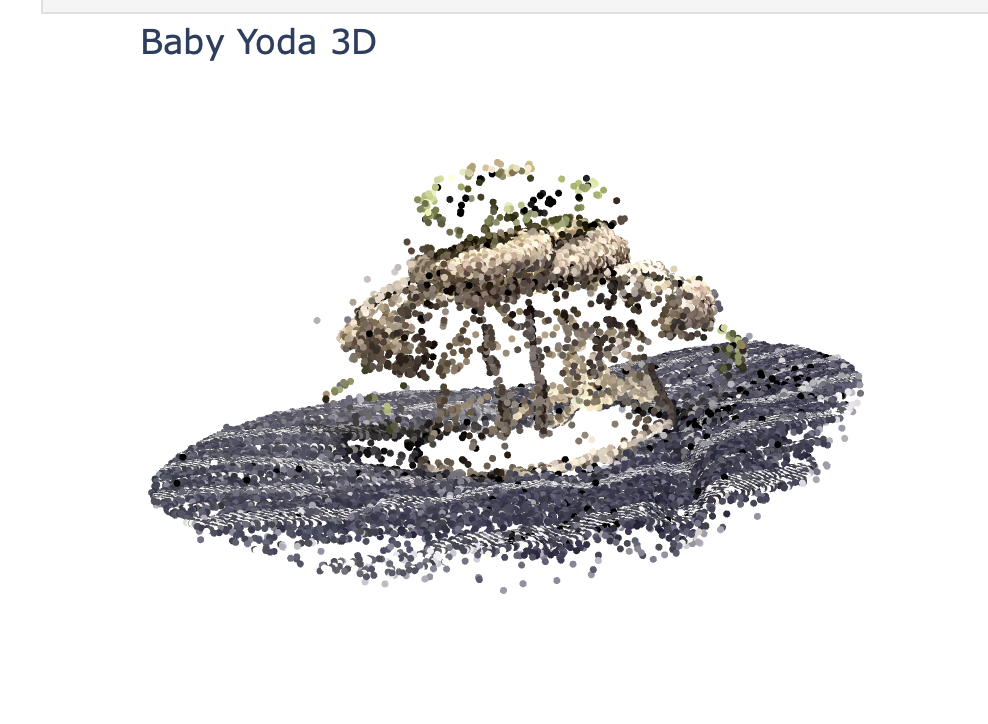
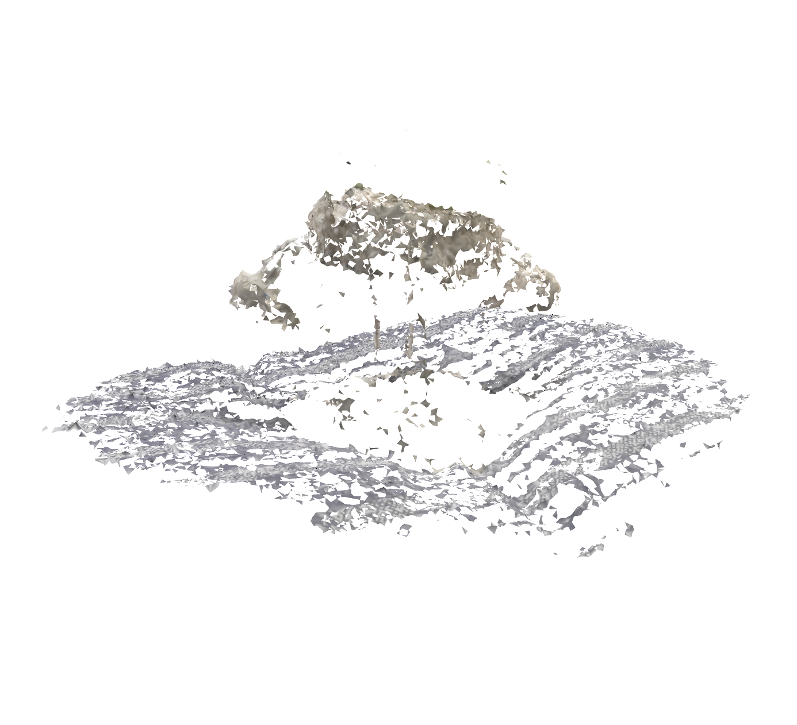

# Task_14 по курсу "Трехмерные модели"

**Выполнила:** Большова Елизавета Александровна

## Результаты работы
Реализован полный цикл трехмерной реконструкции реального объекта (фигурка Йоды на подушке) .
**Входные данные:** 55 фотографий объекта, снятых по круговой траектории.
**Реализованные этапы:**
1. **Structure-from-Motion (SfM):** Восстановление разреженного облака точек и расчет внешних параметров камер (поз).
2. **Bundle Adjustment:** Глобальная оптимизация координат точек и ориентации камер для минимизации ошибки проекции.
3. **MVS (Workaround):** Плотная реконструкция поверхности на основе разреженных данных (из-за ограничений cpu-режима).
4. **Alpha Shapes:** Построение полигональной сетки (Mesh) для формирования твердотельной модели.

## Описание процесса и анализ результатов

1.  **Извлечение и сопоставление признаков (SIFT):** Проведен поиск инвариантных ключевых точек. С помощью **Exhaustive Matching** соответствия между всеми парами 55 кадров.
2.  **Разреженная реконструкция (SfM):** 
    *   Средняя ошибка репроекции (Mean Track Error) составила менее 1 пикселя.
    *   Наилучшая плотность точек на текстурированных участках (подушка под йодой, одежда йоды), гладкие и глянцевые участки головы восстановились менее детально.
3.  **Реконструкция поверхности (MVS альтернатива):** Из-за отсутствия CUDA на моем ноутбуке для стандартного метода `patch_match_stereo`, был применен метод **Alpha Shapes** поверх разреженного облака. Была проведена оценка нормалей (`Normal Estimation`) с ориентацией векторов к центру масс объекта.

## Примеры визуализации

### 1. Исходный образец (один из 55 ракурсов)

### 2. Реконструкция в COLMAP GUI (Sparse Cloud + Camera Poses)

### 3. Итоговое облако точек (Plotly)

### 4. Реконструкция поверхности (MVS Mesh)

---
**Итоговые модели в формате .PLY доступны в папке `Task_14/results`.**

## Технические особенности реализации

1.  **Архитектура ARM64 (Apple M4 Pro):** Сборка COLMAP была ограничена CPU. Попытки использования SiftGPU приводили к ошибкам инициализации, в связи с чем весь пайплайн переведен на многопоточное выполнение на ядрах CPU.
2.  **Визуализация:** Использован кастомный визуализатор на **Plotly**, так как `draw_geometries` в Open3D вызывает критический сбой (Segmentation Fault) при работе с большими облаками.
3.  **MVS Workaround:** Поскольку `patch_match_stereo` требует CUDA, этап плотной реконструкции заменен на программную генерацию нормалей и триангуляцию в Open3D, экспортирована в PLY.