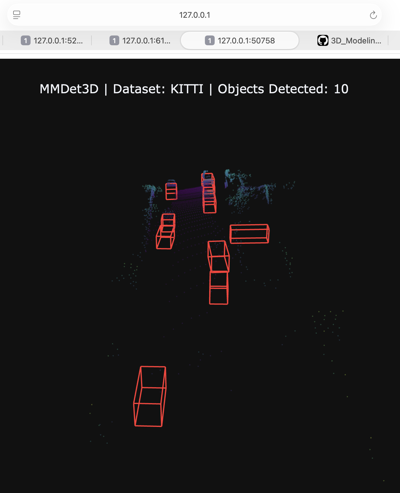
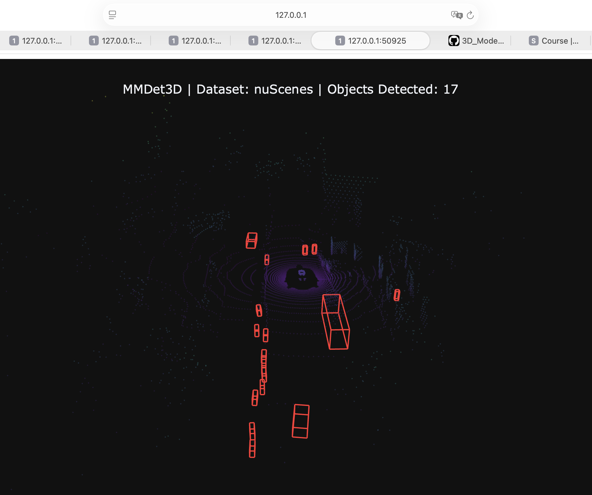

# Task_16. MMDetection3D: Инициализация и инференс на 3D данных

**Выполнила:** Большова Елизавета Александровна

## Результаты работы

Удалось развернуть **MMDetection3D** (OpenMMLab) на M4 Pro (CPU).
Запустила нейросеть **PointPillars** только на двух ключевых датасетах для автономного вождения: **KITTI** и **nuScenes**.

### 1. Детекция на датасете KITTI
Модель успешно распознала автомобили в дорожном потоке.

### 2. Детекция на датасете nuScenes
Обработка сложной сцены с лидара (360-градусный обзор).

---

**Реализованные обходные пути:**
1.  **Компиляция MMCV из исходников:** Библиотека компьютерного зрения `mmcv` была скомпилирована вручную с флагами `FORCE_CUDA=0` и `MMCV_WITH_OPS=1`, чтобы собрать C++ расширения (ops) для CPU архитектуры Apple Silicon.
2.  **Обход PEP 660:** Установка `mmdet3d` производилась через прямой вызов `setup.py develop`, так как современные версии `pip` конфликтовали с системой сборки проекта.
3.  **Визуализация:** Стандартные визуализаторы Open3D вызывали *Segmentation Fault* на macOS. Был написан скрипт визуализации на базе библиотеки **Plotly**, отрисовывающий облака точек и каркасные 3D-боксы (Wireframes).

## Почему не удалось запустить ScanNet и SUN RGB-D

В работе были протестированы 4 датасета, однако для **ScanNet** и **SUN RGB-D** инференс на CPU оказался технически невозможен в данной версии библиотеки.

**Причина:**
Эти датасеты используют архитектуры **PointNet++** и **VoteNet**. Ключевой операцией в них является **FPS (Furthest Point Sampling)** — выборка наиболее удаленных точек.
В текущей реализации `mmcv` для MMDetection3D операция `furthest_point_sample` жестко завязана на использование CUDA-ядер (`torch.cuda.IntTensor`). При попытке запуска на CPU возникает неустранимая ошибка типизации, так как аналогичной оптимизированной реализации для CPU/MPS в ядре библиотеки нет.

Модели **PointPillars** (использованные для KITTI и nuScenes) используют вокселизацию (Pillar Feature Net), которая корректно работает на CPU, что и позволило успешно выполнить задание для этих данных.

## Итоговая реализация
*   `safe_det_kitti.py` / `safe_det_nuscenes.py` — скрипты инференса, очищенные от GUI-зависимостей.
*   `visualize_final.py` — скрипт для генерации интерактивных графиков и отчетов.