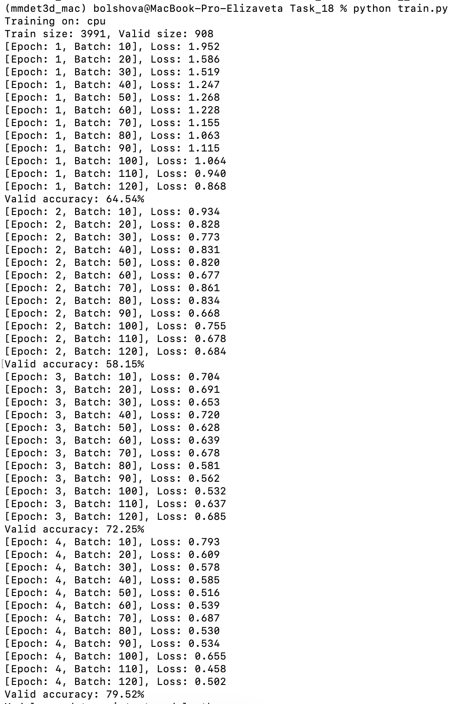
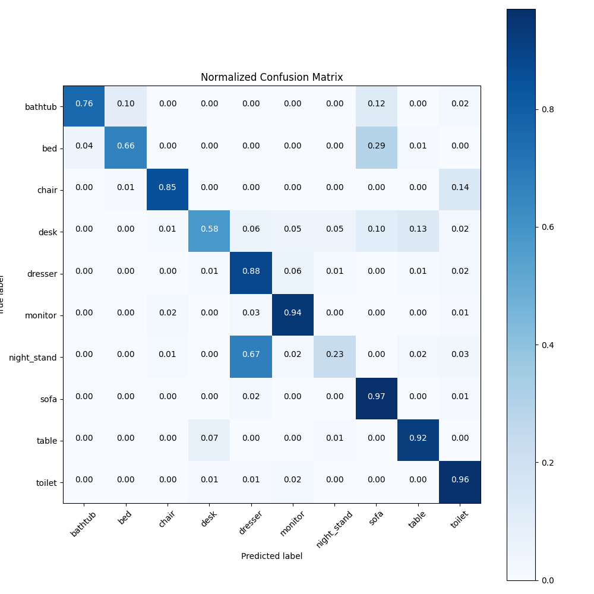
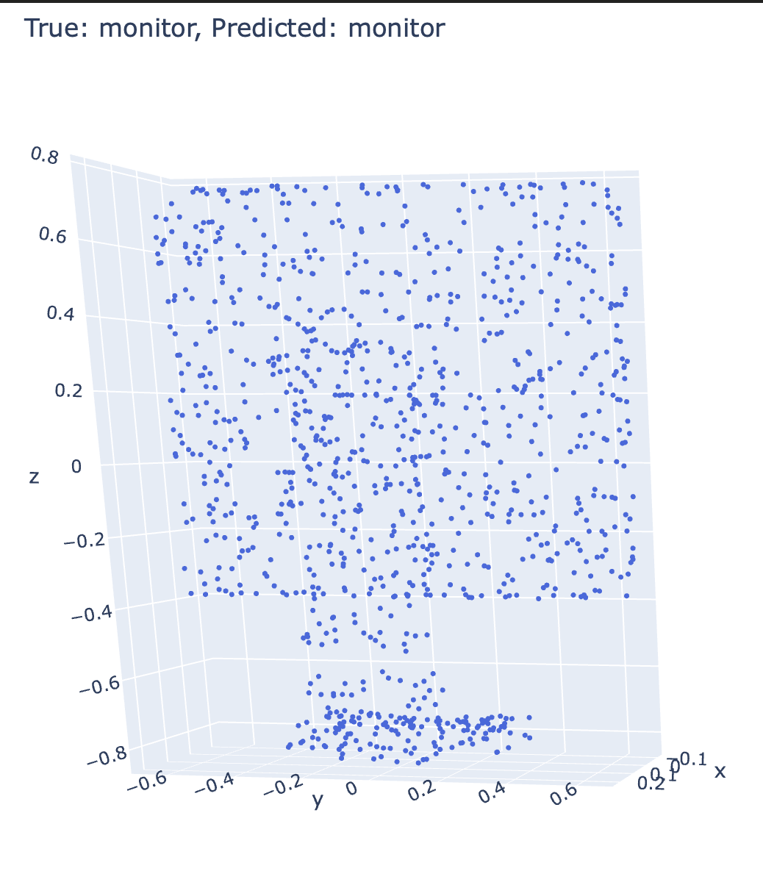
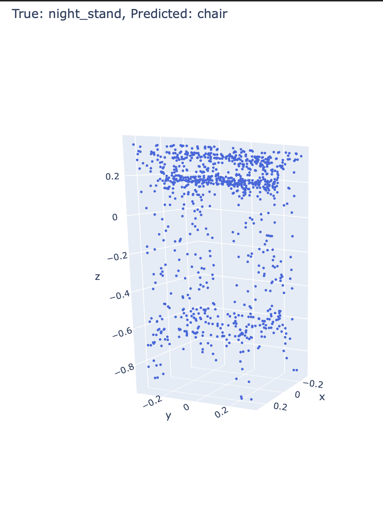

# Task_18. Классификация облаков точек (PointNet на ModelNet10)

**Выполнила:** Большова Елизавета Александровна

## Результаты работы
Реализована и обучена нейронная сеть архитектуры **PointNet** для задачи классификации трехмерных геометрических объектов.
*   **Датасет:** ModelNet10 (10 классов мебели: стол, стул, диван, туалет и др.).
*   **Точность (Validation Accuracy):** **79.52%** (после 4 эпох обучения).
*   

### Матрица ошибок (Confusion Matrix)

### Пример классификации
Визуализация предметов из тестовой выборки с предсказанием сети:

## Описание реализации
Проект структурирован по модульному принципу:
1.  **`dataset.py`**: Включает парсинг `.off` файлов, сэмплинг точек (Barycentric sampling) для приведения всех моделей к 1024 точкам, нормализацию и аугментацию (случайный поворот по оси Z, добавление гауссовского шума).
2.  **`model.py`**: Полная реализация архитектуры **PointNet**. 
    *   Восстановлен модуль **T-Net**. Он отвечает за инвариантность к поворотам входного облака.
    *   Реализован кастомный лосс с регуляризацией ортогональности матриц трансформации.
3.  **`train.py`**: Цикл обучения и валидации модели.
4.  **`evaluate.py`**: Скрипт для расчета итоговых метрик и построения визуализаций.

## Технические особенности
*   **Оптимизация под ARM64:** все запускала на CPU (Apple Silicon). Использованы механизмы `device agnostic` в PyTorch.
*   **Производительность:** Несмотря на отсутствие GPU, оказалась очень легковесностная архитектура PointNet, обучение прошло очень быстро.