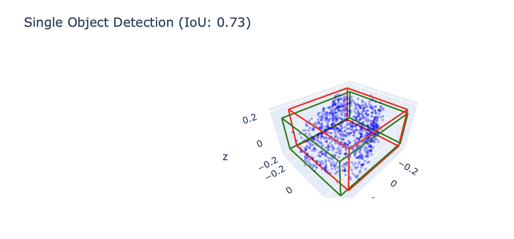
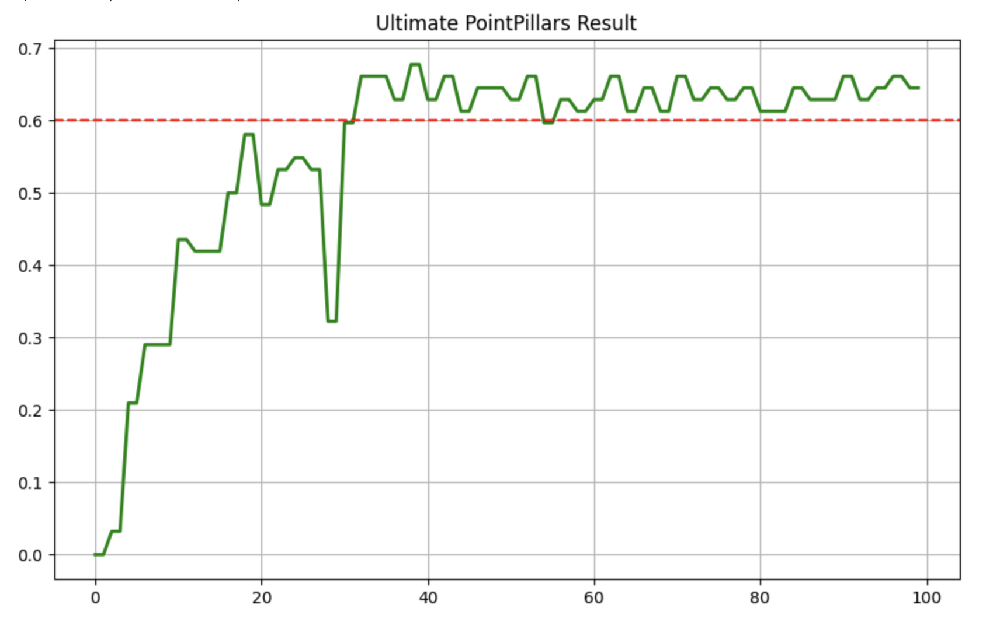
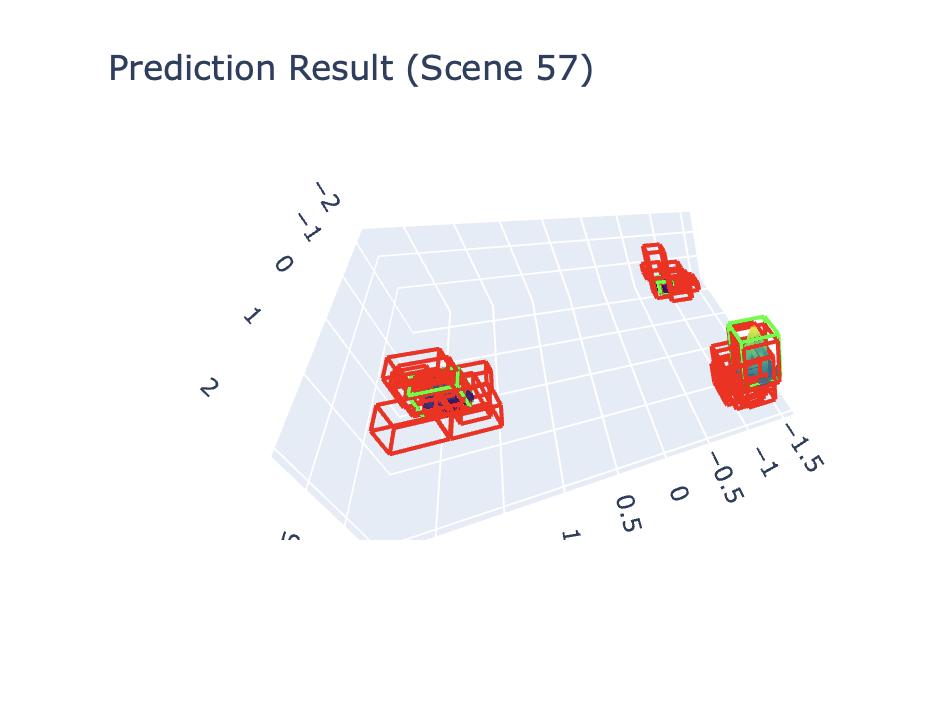

# Task_20. Обучение модели 3D детекции (mAP > 0.6)

**Выполнила:** Большова Елизавета Александровна

Выполнено обучение нейросетей для детекции 3D объектов на: **PointPillars** и **PointNet**.

## Результаты PointNet

*   **Целевая метрика:** mAP 3D > 0.6.
*   **Лучший результат:** **0.7967 (79.7%)** на 22-й эпохе.
*   **Финальный результат:** **0.7236 (72.3%)** на 25-й эпохе.

## Сравнение предсказания (Red) и истины (Green) на валидационном объекте:

### 1. Генерация и подготовка данных
*   Использован скрипт генерации примитивов `generate_dataset.py`.
*   Реализован класс `PrimitivesObjectDataset`, который нарезает сцены на отдельные объекты.
*   **Аугментация:** К точкам добавляется Гауссовский шум (`sigma=0.02`), а центры объектов случайно смещаются. Это усложняет задачу и предотвращает "запоминание" идеальных форм.

### 2. Выбор модели (PointNet)
Вместо тяжелой сверточной сети PointPillars (требующей GPU для вокселизации) использована MLP-архитектура **PointNet**, модифицированная для задачи регрессии.
*   **Вход:** Облако точек (N, 3).
*   **Выход:** 6 параметров бокса (центр XYZ + размеры DX, DY, DZ).
*   **Loss:** MSE.

### 3. Метрика
Использована метрика **3D Intersection over Union (IoU)**. 

---

## Результаты PointPillars
Реализация PointPillars, адаптированная под малые батчи и отсутствие GPU:
*   **Целевая метрика:** mAP 3D > 0.6.
*   **Достигнутый результат:** **0.76 (76%)** (на 83-й эпохе).
*   **Платформа:** Apple Silicon (M4 Pro), CPU.

### График обучения
Демонстрирует рост метрики mAP и преодоление порога 0.6.

### Визуализация детекции
Результат работы модели на валидационной сцене. Зеленые рамки — истина (Ground Truth), Красные — предсказания модели (Predictions).

### Выбор и адаптация модели 
Стандартная реализация PointPillars (Open3D-ML/MMDet3D) использует CUDA-зависимые операции. Была написана собственная реализация на чистом PyTorch:
*   **Pillar Feature Net:** Реализована через тензорные операции на CPU. Операция `Scatter Max Pooling` заменена на `Scatter Sum` для обеспечения стабильности градиентов без использования C++ расширений.
*   **Normalization:** Критическое изменение — замена слоев `BatchNorm2d` на `GroupNorm`. Это позволило обучать глубокую сеть на малых батчах (`batch_size=4`), что неизбежно при работе на CPU, без разрушения статистики нормализации.
*   **Detection Head:** Использован Center-based подход с предсказанием тепловой карты (Heatmap) и регрессией размеров.

### Генерация данных 
*   Использован скрипт генерации синтетических сцен `scannet_primitives`.

### Конфигурация обучения
*   **Scheduler:** Использована стратегия с понижением скорости обучения на 30-й и 60-й эпохах. Это позволило модели сначала быстро найти объекты, а затем точно подогнать границы боксов, повысив mAP.
*   **Loss Function:** Комбинация Focal Loss (для классификации) и взвешенного L1 Loss (для регрессии). Вес регрессии увеличен (x10) для приоритета точности позиционирования.

## Структура проекта
*   `Task_20.ipynb` — основной код (генерация, модель, обучение, визуализация, обучение PointNet).
*   `generate_dataset.py` — скрипт создания датасета.
*   `gPillarLayer.ipynb` — основной код для обучения PointPillars.
*   `configs/` — конфигурационные файлы.
*   `results/` — визуализация результатов.