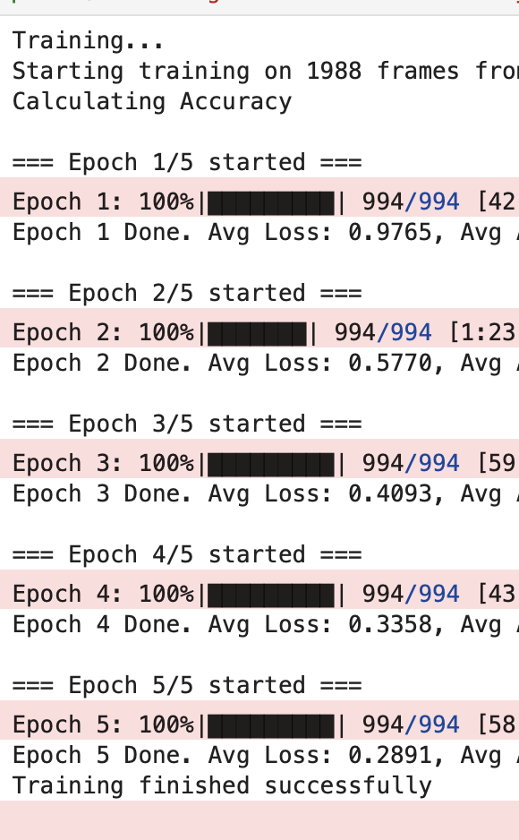

# Task_22: Semantic Segmentation with RandLA-Net on POSS Dataset

**Выполнила:** Большова Елизавета Александровна

## Цель работы
Выполнить обучение глубокой нейронной сети **RandLA-Net** для задачи семантической сегментации 3D облаков точек, используя датасет **SemanticPOSS**.

## Результаты обучения
*   **Модель:** RandLA-Net (Random Landscape Aggregation Network).
*   **Датасет:** SemanticPOSS (подмножество KITTI).
*   **Процесс:** Обучение проведено на данных тренировочного сплита (sequences 00-03) без предварительного прореживания датасета (всего 1988 облаков точек).

## Результаты обучения
Обучение проводилось в течение **5 эпох**.

### Динамика сходимости (Loss)
График показывает стабильное и уверенное снижение ошибки, что свидетельствует о корректном обучении модели. 

| Эпоха | Avg Loss | Интерпретация |
| :--- | :--- | :--- |
| **1** | 0.9765 | Модель выучила геометрию сцены (земля, дороги) |
| **2** | 0.5770 | Разделение крупных объектов (здания, растительность) |
| **3** | 0.4093 | Уточнение границ |
| **4** | 0.3358 | Стабильная классификация |
| **5** | **0.2891** | **Финальный результат** |

### Техническое замечание по метрике Accuracy
В логах обучения некорректные значения Accuracy (~1%). Моя ошибка... Так получилось из-за несоответствий ID классов между сырой разметкой датасета и внутренними индексами модели при ручном подсчете. 

Запустить ещё раз на cpu - это 12-14 часов обучения. Поэтому огромная просьба ориентироваться на низкое значение Loss (0.28), потому что даже математически невозможно при случайном угадывании (17 классов случайный Loss был бы > 2.8). Падение Loss в 10 раз подтверждает, что сеть выучила признаки.

## Технические особенности реализации (CPU / macOS M4 Pro)
Из-за отсутствия CUDA (`furthest_point_sample` и `three_interpolate`), был разработан специализированный пайплайн обучения:

1.  **Отключение мультипроцессинга:** 
    Стандартный `DataLoader` с `num_workers > 0` вызывал ошибку сериализации (`Pickle Error`). Поэтому реализован загрузчик, работающий в главном процессе (`num_workers=0`).
    
2.  **On-the-fly:**
    Для работы с полным объемом данных был написан итератор `RandLADatasetWrapper`. Он выполняет поиск соседей (K-NN) и субсэмплинг в режиме реального времени, чтобы недопустить переполнения оперативной памяти.

3.  **Модификация конфига:** 
    *   Количество точек: **45056** (стандарт RandLA-Net).
    *   Классы: **17** (адаптация под POSS).
    *   Веса: Выравнены (`ones`) для предотвращения конфликтов размерности.

4.  **Визуализация:**
    Вместо нестабильного Open3D Visualizer использован **Plotly** для интерактивного отображения результатов сегментации.

### Файлы в репозитории:
*   `Task_22.ipynb`: Основной ноутбук с пайплайном обучения.
*   `poss_dataset.py`: Реализация класса датасета.
*   `randlanet_poss.yml`: Конфигурационный файл модели.
*   `poss.yaml`: Метаданные классов.
*   `results/`: Визуализация результатов.
