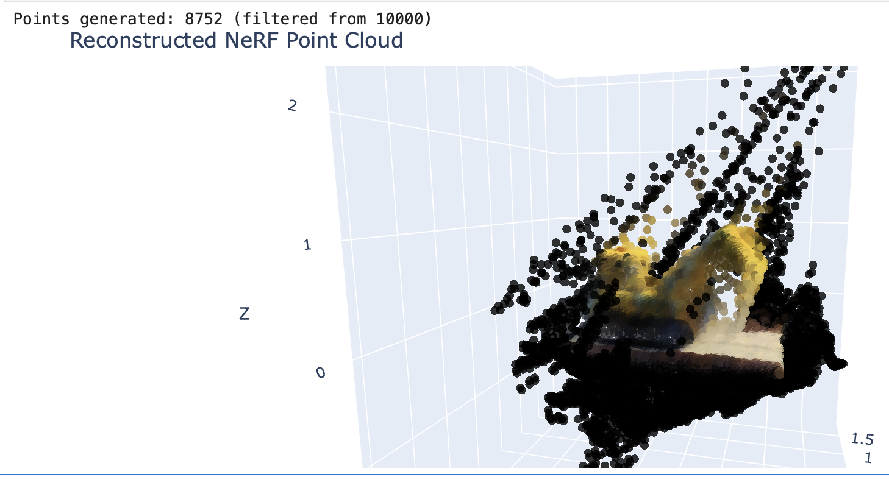
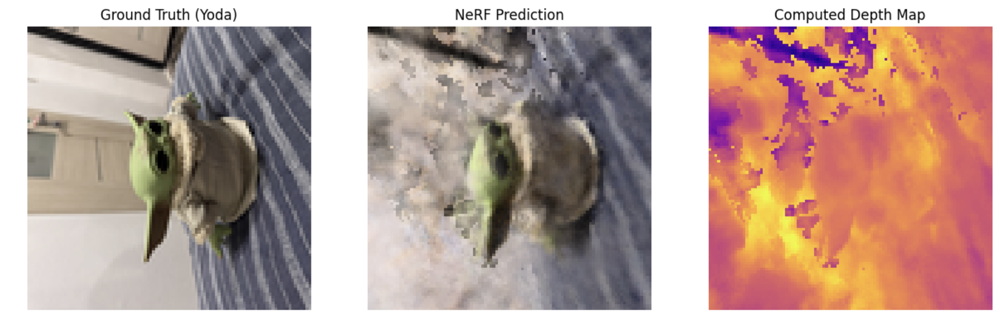
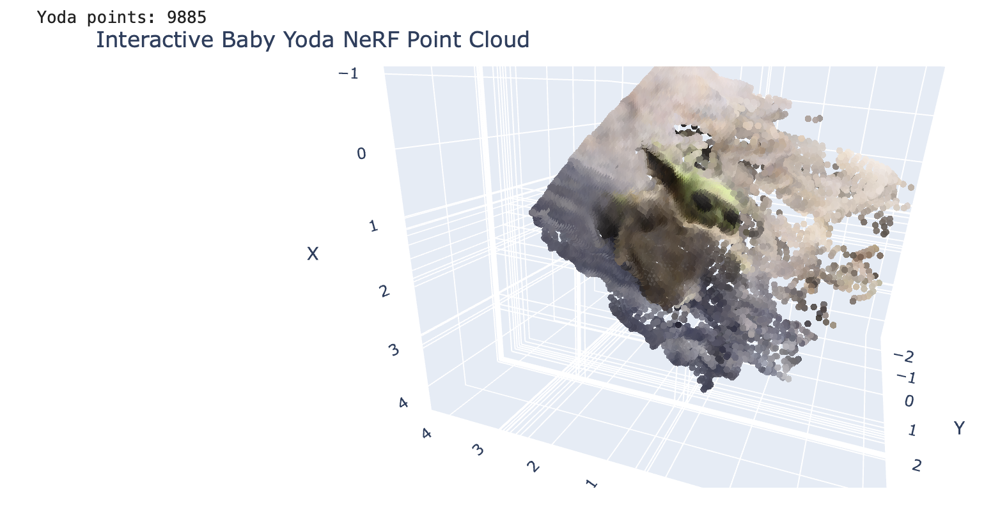
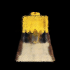
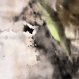
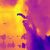

# Task_24: 3D Reconstruction using Neural Radiance Fields (NeRF)

**Выполнила:** Большова Елизавета Александровна

## Цель работы
Реализовать алгоритм **NeRF** для синтеза новых ракурсов и восстановления трехмерной структуры объектов на основе набора 2D-изображений. Работа включает обучение на стандартном синтетическом датасете и создание собственного набора данных с использованием **COLMAP**.

## Технические особенности реализации (CPU / macOS M4 Pro)
В данной работе использование стандартного фреймворка *Nerfstudio* было **невозможно** из-за отсутствия поддержки CUDA на архитектуре ARM64. Реализован пайплайн на **PyTorch**, оптимизированный для **CPU**:

1.  **Вычислитель:** Строго `device = 'cpu'`. Для компенсации GPU применена векторизация генерации лучей и пре-компьютинг (расчет всех лучей датасета перед обучением).
2.  **Архитектура:** Полносвязная сеть (MLP) с **Positional Encoding** (L=6) для передачи высокочастотных деталей и **Skip-connections** (проброс связей) для стабильности градиентов.
3.  **Визуализация:** Использована библиотека **Plotly** для 3D-облаков точек и **Matplotlib** для карт глубины, так как нативные средства визуализации Open3D вызывают Segmentation Fault на macOS.

## Стандартный датасет (Lego Bulldozer)
Обучение проводилось на синтетическом наборе данных (100 кадров, 100x100). 

### Результаты обучения:
*   **Итераций:** 3000.
*   **PSNR:** **23.12 dB**.
*   **Особенности:** Модель успешно выучила сложную геометрию ковша. На облаке точек (Point Cloud) видны артефакты фона (черные точки), однако плотность объекта сконцентрирована корректно.

## Собственный датасет (Baby Yoda)
Создан набор из **54 фотографий** игрушки Baby Yoda на подушке.

### Процесс подготовки:
1.  **SfM (Structure from Motion):** Использован **COLMAP CLI** для автоматического извлечения признаков и вычисления поз камер.
2.  **Coordinate Transformation:** Разработан скрипт для конвертации систем координат COLMAP (OpenCV) в формат NeRF (OpenGL) и нормализации масштаба сцены.

### Динамика прогресса:
Обучение проводилось два раза, что наглядно продемонстрировало влияние глубины сети на качество:

| Параметр | Запуск 1 | Запуск 2 | Интерпретация |
| :--- | :--- | :--- | :--- |
| **Слои (D)** | 6 | 8 | Увеличение емкости сети |
| **Нейроны (W)** | 128 | 256 | Улучшение детализации |
| **Итерации** | 3000 | **10000** | Глубокое обучение |
| **PSNR** | 17.40 dB | **19.34 dB** | **Качественный рост** |

Несмотря на сложный бытовой фон (дверь, складки ткани), модель во втором запуске смогла четко отделить объект и восстановить его форму на карте глубины.

### Файлы в репозитории:
*   `Task_24.ipynb`: Полный пайплайн обучения и рендеринга.
*   `colmap_workspace/`: Данные реконструкции камер.
*   `lego_bulldozer_360.gif`: Визуализация вращения синтетического объекта.
*   `baby_yoda_360.gif`: Финальный результат на собственных данных.
*   `baby_yoda_depth.gif`: Тепловая карта (глубина) собственного объекта.
*   `results/`: Визуализация результатов.

## Визуализация результатов

### Синтетический датасет (Lego)

### Собственный датасет (Baby Yoda)
Сравнение визуального качества (RGB) и восстановленной геометрии (Depth Map):

  
  

