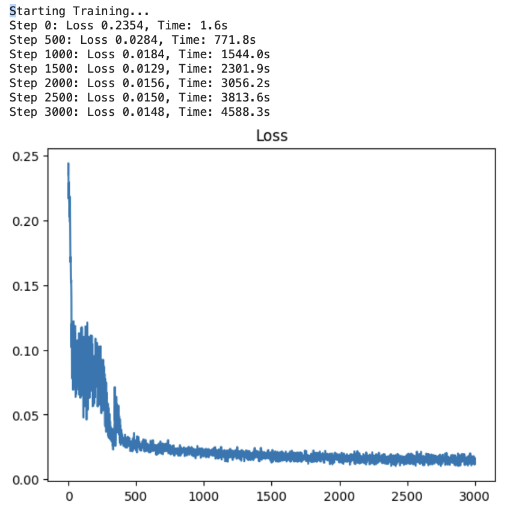
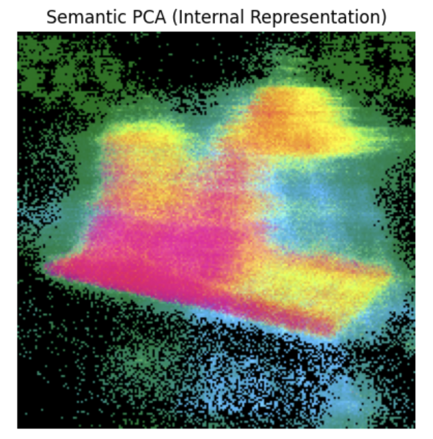
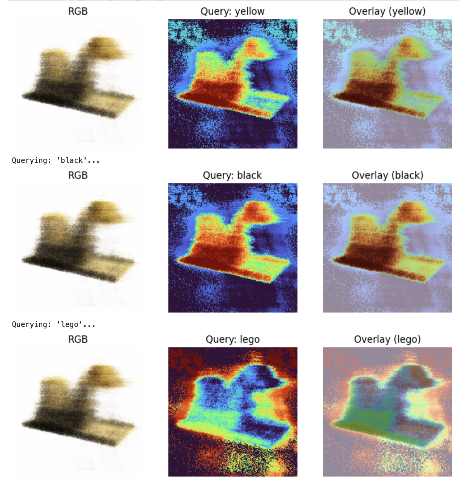
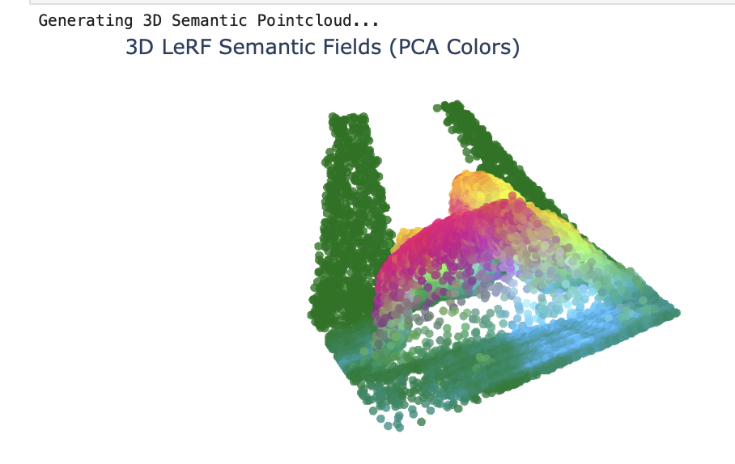

# Task_26: Language Embedded Radiance Fields (LeRF)

**Выполнила:** Большова Елизавета Александровна

## Цель работы
Реализовать метод **LeRF** (расширение алгоритма NeRF), которое помимо цвета и плотности восстанавливает **семантическое поле** сцены. Это позволяет выполнять поиск 3D-объектов по текстовым запросам с использованием предобученной модели **CLIP**.

## Технические особенности реализации (CPU / macOS M4 Pro)
Работа выполнена в условиях ограничений (отсутствие CUDA, несовместимость стандартных библиотек Nerfstudio с macOS). Реализован пайплайн на PyTorch:

1.  **Архитектура LeRF:** К стандартному NeRF добавлена "семантическая голова" (MLP), предсказывающая CLIP-вектора (размерность 512) для каждой точки пространства.
2.  **OpenCLIP Integration:** Вместо стандартного изменения размера изображений реализован механизм извлечения патчей (patches) из **ViT-B/32**. Это позволило сохранить детализацию объектов на низком разрешении.
3.  **Training:** Для преодоления ограничений разрешения CLIP входные данные были увеличены до **200x200**, а размер батча оптимизирован (2048 лучей) для загрузки.

## Датасет (High-Res Lego)
Использован оригинальный датасет Blender Lego, адаптированный под разрешение 200x200.

### Динамика обучения
Обучение проводилось на протяжении **3000 итераций**. 

*   **Final Loss:** **0.0148** (комбинация MSE для цвета и Cosine Distance для семантики).

## Результаты: Внутреннее представление (PCA)
Анализ главных компонент (PCA) предсказанных семантических векторов. Модель **самостоятельно сегментировала** объект на функциональные части:
*   **Зеленые зоны:** Ковш и задние рычаги.
*   **Розовые зоны:** Кабина и моторный отсек.
*   **Синие зоны:** Гусеницы.

## Результаты: Текстовые запросы 
Модель способна локализовать объекты по текстовому описанию.
*   Запрос **"yellow"**: Активирует корпус и ковш.
*   Запрос **"black"**: Акцентирует внимание на тенях, кабине и гусеницах.
*   Запрос **"lego"**: Выделяет глобальную форму объекта.

## 3D-Визуализация
Финальная реконструкция в виде облака точек, окрашенного по методу PCA. Семантическое поле является **непрерывным и геометрически согласованным** в 3D-пространстве.

### Файлы в репозитории:
*   `Task_26.ipynb`: Полный пайплайн. 
*   `results/`: Скриншоты метрик и визуализаций.