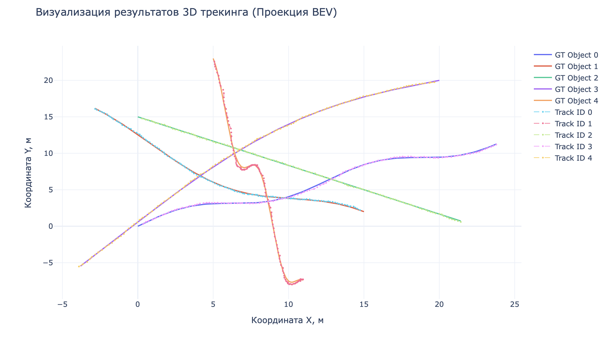

# Task_28: 3D Multi-Object Tracking based on AB3DMOT

**Выполнила:** Большова Елизавета Александровна

## Цель работы
Реализовать систему многообъектного трекинга (MOT) на основе фильтра Калмана и венгерского алгоритма. Работа включает в себя переход от точечного трекинга к полноценному учету геометрии объектов (2D-боксы), реализацию жизненного цикла треков и исследование влияния параметров матриц ковариации на устойчивость траекторий.

## Технические особенности реализации (CPU / macOS M4 Pro)
Из-за отсутствия NVIDIA и нестабильности Metal Performance Shaders (MPS) для данных задач, весь вычислительный пайплайн оптимизирован для **CPU**:

## Часть 1. Переход к 2D-боксам и расширенному состоянию
*   **Вектор состояния:** Расширен до 10 параметров: $\mathbf{x} = [x, y, z, v_x, v_y, v_z, \psi, \dot{\psi}, w, h]^\top$. Фильтр Калмана не только предсказывать движение, но и сглаживать шум в оценке размеров объекта ($w, h$).
*   **Метрика IoU:** Стандартное евклидово расстояние заменено на **IoU прямоугольников** (AABB). Это повысило устойчивость ассоциации, так как учитывается площадь перекрытия объектов, а не только их центры.

## Часть 2. Моделирование 5 объектов
Создана сцена с 5 объектами, движущимися по нелинейным траекториям:
1.  **Синусоида:** Проверка реакции на переменное ускорение.
2.  **Круг:** Тестирование стабильности оценки угловой скорости ($\dot{\psi}$).
3.  **Пересекающиеся линии:** Проверка работы венгерского алгоритма в условиях сближения объектов.

### Результаты (Balanced Scenario):
*   **MAE (Mean Absolute Error):** **0.1008 м**.
*   **Matching Accuracy:** **98.3%**.
*   **Интерпретация:**  Ошибка в 10 см при зашумленных измерениях говорит об эффективной работе фильтра Калмана в режиме сглаживания. Высокая точность ассоциации подтверждает надежность венгерского алгоритма на плотных потоках объектов.

## Часть 3. Улучшения и физические ограничения
1.  **Reject-association:** Порог `match_threshold = 0.8` блокирует сопоставления с низким IoU, предотвращая прыжки треков между далеко стоящими объектами.
2.  **Speed Limit:** Ограничение скорости (**10 м/с**). Если зашумленная детекция вызывает аномальный скачок вектора скорости, фильтр принудительно масштабирует компоненты $v_x, v_y, v_z$.
3.  **Жизненный цикл:** 
    *   **min_hits (3):** Подтверждение трека только после серии успешных обновлений.
    *   **max_age (10):** Удержание трека при временных пропусках детектора за счет экстраполяции состояния.

## Часть 4. Анализ матриц шумов Q и R
Анализ зависимости качества трекинга от соотношения доверия к модели и датчику.

| Сценарий | MAE (м) | Поведение |
| :--- | :--- | :--- |
| **Balanced** | **0.1008** | Оптимальное сглаживание и динамика. |
| **Smooth ($Q \downarrow, R \uparrow$)** | 0.2527 | **Lagging:** Трек запаздывает на поворотах из-за избыточной веры в прямолинейную модель. |
| **Jittery ($Q \uparrow, R \downarrow$)** | 0.1902 | **Noise Hugging:** Трек повторяет каждое случайное колебание шума детектора. |

### Выводы по параметризации:
Наилучшие результаты достигаются при сбалансированных значениях, где шум позиции в модели ($Q$) на порядок меньше шума детектора ($R$), что позволяет фильтру эффективно выполнять роль низкочастотного фильтра.

## Файлы в репозитории:
*   `Task_28.ipynb`: Ноутбук с полным кодом решения.
*   `results/tracking_results.png`: Финальная визуализация траекторий.